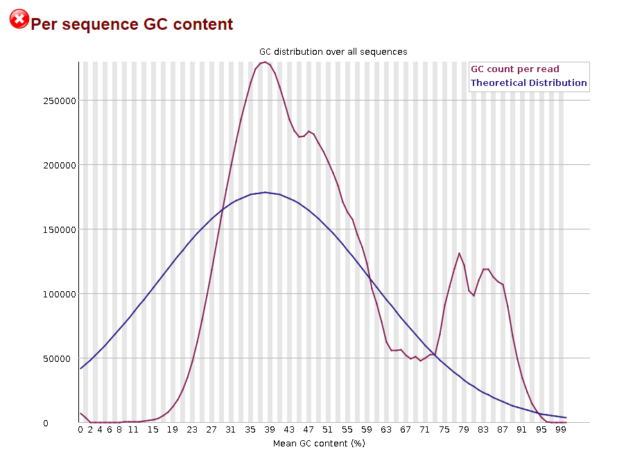
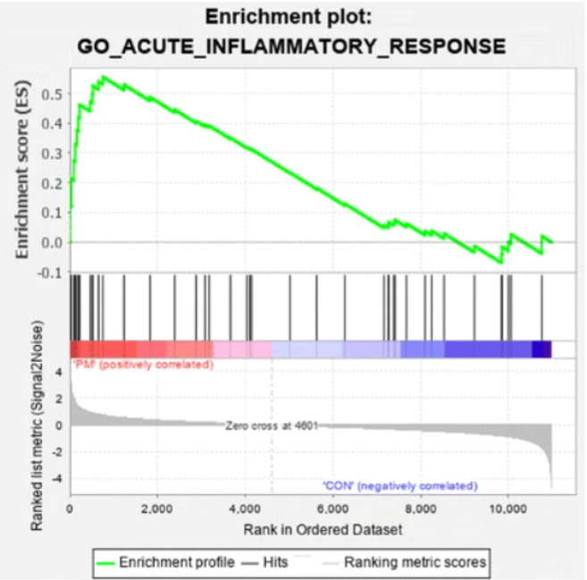

## Evaluate the QC metrics for the full data
MultiQC analysis of the aligned reads indicated that at least 95.8% of the reads 
successfully mapped to the reference genome, with 91.9% aligning uniquely. Given 
that over 90% of reads were uniquely mapped, the alignment quality is deemed 
acceptable. Additionally, most reads longer than 10 bp exhibited sequence 
quality scores exceeding 35, further supporting the high quality of the 
sequencing data. The GC content distribution was uniform across all samples, 
suggesting that the library preparation was successful and free of systematic 
biases. Furthermore, adapter content was consistently below 1%, confirming the 
efficacy of the adapter trimming process. Overall, the sequencing data 
demonstrated high quality with no major concerns.


## ENRICHR analysis on the significant genes
According to KEGG 2021 Human, PI3K-Akt signaling pathway and ECM-receptor 
interaction were the most significantly enriched pathways. This suggests that 
cellular processes related to growth, survival, migration, and invasion are 
highly active. The PI3K-Akt pathway promotes cell proliferation, survival, and 
anti-apoptotic signaling, while the ECM-receptor interaction facilitates cell 
adhesion, movement, and communication with the extracellular environment. Their 
simultaneous activation is commonly associated with cancer progression, as ECM 
remodeling and integrin signaling can enhance PI3K-Akt-driven cell survival and 
metastasis, particularly through FAK and Rho GTPases, which regulate 
cytoskeletal dynamics and cell migration. 


## RNAseq Quality Control Plots
In the PCA projection, three distinct clusters were observed. The control 
samples were clearly separated from the treated samples, indicating that the 
treatment had a significant impact on the gene expression profile. The treated 
samples were further divided into two clusters, which might suggest the presence 
of biological variability among individuals or batch effects.

In the heatmap of the sample-to-sample distances for the experiment, the control
and treated samples formed two distinct clusters, indicating that they have 
distinct gene expression profiles. While the control samples exhibited a high 
degree of similarity, the treated samples formed a subcluster, which is 
consistent with the PCA results. The strong similarity among the control samples 
suggests stable gene expression profiles across replicates, which is 
experimentally desirable.


## FGSEA Analysis
NABA_collagens, NABA_core_matrisome, NABA_secreted_factors, and 
NABA_ECM_regulators are significantly up-regulated in GSEA. This suggests ECM 
remodeling, which supports cell signaling, tissue organization, and repair. 
Increased collagen and ECM proteins levels may indicate tissue fibrosis, often 
associated with chronic inflammation or disease. 


## Replicate figure 3C and 3F
In my analysis, 312 genes were upregulated (log2FC > 0, padj < 0.01), and 396
genes were downregulated (log2FC < 0, padj < 0.01), while authoes reported 319 
were upregulated and 412 downregulated.


The paper’s enrichment analysis relies on Reactome, whereas mine uses 
MSigDB C2:CP, resulting in different pathway definitions (e.g., “NABA_COLLAGENS”
vs. “Extracellular matrix organization”). The paper also restricts enrichment to
strictly significant DE genes (e.g., FDR < 0.01), whereas I perform GSEA across 
all genes without applying a significance cutoff. This, combined with different 
thresholds for low-expression filtering (50 vs. 5 reads) and distinct 
normalization approaches, can lead to noticeable discrepancies in adjusted 
p-values—your analysis may produce higher adjusted p-values overall 
(e.g., 0.4–1.0) because it tests a broader gene set, whereas the paper’s more 
stringent filtering typically yields stronger (lower) p-values for selected 
pathways.


## Methods for my pipeline
Raw RNA-sequencing reads were first subjected to quality control using FastQC. 
The STAR aligner was then used to build a reference genome index based on the 
GRCh38 reference genome and its corresponding GTF annotation. High-quality reads 
were aligned to the indexed genome using STAR, and post-alignment quality 
metrics were summarized with MultiQC.
For quantification, the VERSE tool was used to count reads mapped to each gene. 
Genes with low expression levels (<5 reads across all samples) were removed from
downstream analysis.
Differential expression analysis was performed using DESeq2 on the filtered 
count matrix. PCA was conducted using the plotPCA function from DESeq2, based on
variance-stabilizing transformed (VST) counts obtained using the vst() function 
with blind = FALSE.
Gene Set Enrichment Analysis (GSEA) was performed using the fgsea package with a
preranked list of all genes based on their log₂ fold change values. Genes were 
ranked in descending order and mapped to canonical pathways from the 
MSigDB C2:CP (Canonical Pathways) collection using msigdbr. Enrichment was 
assessed across all genes without applying a significance cutoff, allowing the 
identification of pathways enriched among both upregulated and downregulated 
genes.


My pipeline employs VERSE for gene-level counting, while the paper uses 
featureCounts (excluding duplicates, chimeric/multimapping reads, and low MAPQ) 
and thus may yield slightly different raw counts. I remove genes with fewer than
5 reads, whereas the paper’s threshold is 50 reads, leading to a broader set of 
genes in my analysis. In terms of normalization and PCA, I use DESeq2’s 
variance-stabilizing transformation with plotPCA, while the paper applies voom 
plus prcomp. Finally, My GSEA uses fgsea on a full, preranked gene list, whereas
the paper performs enrichment on only those genes with FDR < 0.01, separately 
for up- and downregulated sets.


# Project 1 - Discussion Questions
## RNAseq
**1.** List the major high-level steps of a basic RNAseq experiment to look for
differentially expressed genes. At each step, list what data you need to perform
each step and what format they are in (if applicable). At minimum, there are 4
essential steps.

  1: Raw‑read QC: Sequencer output (FASTQ/FASTQ.gz) > QC reports (HTML, TXT)
  
  2: Alignment: FASTQ; reference genome (FASTA) + annotation (GTF/GFF3) > BAM 
  file
  
  3: Quantification: BAM + annotation (GTF) > Gene count matrix (TSV/CSV)
  
  4: Filtering & Normalization: count matrix (TSV/CSV) > Filtered normalized 
  matrix (TSV/CSV)
  
  5: Differential Expression Analysis: Filtered normalized counts + sample 
  metadata (CSV) > DE results table (TSV/CSV)


**2.** Consider the following FastQC plot.

```{r}

```


**2a.** What aspect of the data does this plot show?

  The distribution of GC percentages across all individual sequencing reads.


**2b.** Make an interpretation of this plot assuming the data type was RNASeq.

  The plot shows two peaks that rise above the theoretical distribution — one at
  ≈36% GC and smaller but clear peaks at ≈76% and 84% GC.


**2c.** Do you think this plot indicates there was a problem with the dataset?
  Explain your answer.

  Yes, I do. The peaks at 76% and 84% GC which sit well above the theoretical 
  distribution indicate a technical artifact. While the main 36% GC peak is
  expected for human transcripts, these high‑GC reads should be removed or 
  corrected to avoid biasing downstream quantification.


**2d.** Make a hypothesis about what the problem represents. Outline a 
  bioinformatics strategy that would enable you to confirm your hypothesis. 

  I hypothesize that the unusually high‑GC peaks represent residual rRNA 
  contamination rather than mRNA. To test this, I would extract reads with 
  GC > 75% using seqkit, then align them against a curated rRNA reference using 
  Bowtie2 to quantify the fraction mapping to rRNA.


**3.** What is a splice-aware aligner? When is it important to use a splice-aware
aligner?

  A splice‑aware aligner is an RNA‑seq mapping tool that can split reads across 
  exon–intron boundaries, correctly placing portions of a read on separate exons
  . It is essential for eukaryotic RNA‑seq because mature mRNA has had introns 
  removed, many reads span splice junctions and will not map correctly with a 
  splice‑unaware tool.


**4.** What does a “gene-level” count as produced by VERSE or any other counting
tool in a RNAseq experiment represent?

  A gene-level count in RNA-seq represents the number of sequencing reads that 
  align to the exonic regions of a given gene.


**5.** In your own words, briefly describe what information the matching GTF for a
reference genome stores.

  It stores gene annotation information for a reference genome. It contains 
  information about the location and structure of genes, transcripts, exons, and 
  so on. 


**6.** When counting alignments using VERSE or any other utility, why do we need to
provide the matching reference genome GTF file?

  Because these tools use  the information about the location of genomic 
  features on the genome to determine which reads overlap annotated exonic 
  regions and to assign reads to the correct genes. Without the GTF, the tool 
  wouldn’t know which genomic coordinates correspond to which genes.


**7.** Let’s pretend that this was a GSEA result from an experiment where we treated
293T cells with a drug and compared changes in gene expression to wild-type
cells treated with a vehicle control. The differential expression results are
relative to the control cells (i.e. a positive fold change means a gene is
upregulated upon treatment with the drug)

Assume the following result is statistically significant with a positive NES
(normalized enrichment score) and that it represents a GSEA experiment performed
on the entire list of genes discovered in the experiment ranked by
log2FoldChange (i.e. genes that are “upregulated” in the cells treated with drug
are on the “left” and genes that are “downregulated” due to treatment are on the
“right”).

```{r}

```


**7a.** Form a valid interpretation / conclusion of the results shown in the plot
  given the above setup.

  The pathway is significantly enriched in genes that are strongly upregulated 
  by the drug treatment. The steep rise at the left edge indicates that many 
  genes in the pathway are concentrated among the most highly upregulated genes, 
  suggesting that the drug activates or induces this pathway in 293T cells. 


**7b.** Now consider that all of the genes driving the enrichment are all 
  activators of the inflammatory pathway. Does your interpretation change and if
  so, how?

  The interpretation becomes more specific. The drug treatment induces an 
  inflammatory response in 293T cells, likely by upregulating genes that 
  actively promote inflammation. This suggests that the drug may have 
  pro-inflammatory effects, and the activation of the inflammatory pathway is a
  key part of its mechanism of action or a potential side effect.


**7c.** Finally, consider that all of the genes driving the enrichment all 
  function to inhibit inflammation. Does your interpretation change and if so, how?

  Yes, the interpretation changes. The drug likely has anti-inflammatory 
  effects, as it increases the expression of genes that suppress or regulate the 
  inflammatory response.


**8.** Rank the following quality control metrics for a 2x100nt paired-end illumina 
mRNAseq dataset from most concerning to least concerning. Provide a brief
statement on where you ranked each and why. Assume that the data has not been
processed and was provided as-is from the sequencing machine. 

  1: 50% of reads are multimapped after alignment to the appropriate genome
  This is most concerning. Having half of all reads align to multiple genomic 
  locations severely reduces confidence in gene quantification. This can distort
  downstream differential expression analysis.

  2: Average PHRED score < 20 in the last 10 bases
  A PHRED score < 20 corresponds to a 1% or higher error rate for each base, 
  which increases the chance of mismatches during alignment. If left untrimmed,
  it affects mapping and quantification.

  3: 15% of reads have identical sequences
  A substantial fraction of completely identical reads can indicate PCR
  duplicates or low library complexity. It can artificially inflate expression 
  of some genes.

  4: Unequal number of forward and reverse reads
  Paired-end data assumes one-to-one matching between forward and reverse reads. 
  An imbalance suggests a potential issue in sequencing or file demultiplexing. 
  It can lead to loss of usable pairs and reduced coverage.

  5: Unequal Read Lengths
  Large discrepancies in read lengths can indicate premature truncation or 
  technical issues during sequencing.

  6: 10% of reads are unmapped after alignment to the appropriate genome
  Some degree of unmapped reads is normal in RNA-seq, especially if they span 
  unannotated regions or are degraded. 10% is within a generally acceptable 
  range, though higher rates may warrant investigation.

  7: Non-random nucleotide distribution in the first 6 bases
  Non-randomness in the first few bases is quite common in RNA-seq libraries due 
  to bias from random-priming methods or partial adapter sequences. It usually
  has minimal impact on mapping or quantification, especially after trimming or 
  alignment.

  8: Nucleotide frequencies of ACTG are not equal over the entire read
  Transcriptomes are biologically biased, so unequal base composition is 
  expected and normal. This is only a concern if the bias is extreme or 
  unexpected.